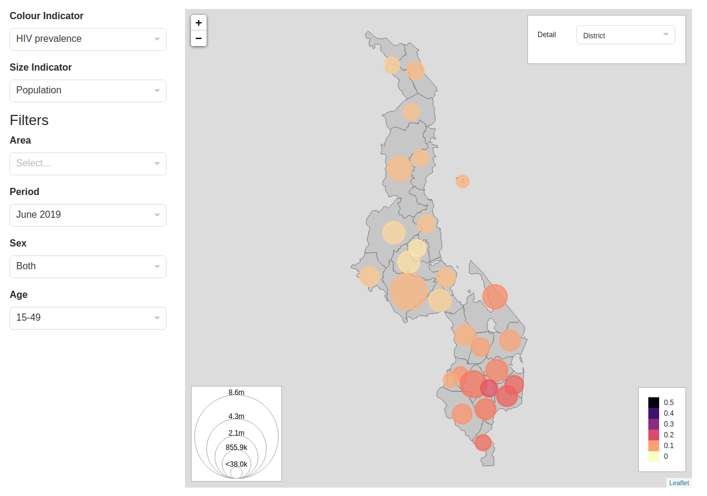

# vue-maps
A library of [Vue](https://vuejs.org/) map components for model visualisation and exploration. These use [Leaflet](https://leafletjs.com/) 
for visualising data in a geographical context. 

## Installation
* Install from npm:
  ```
  npm install @reside-ic/vue-maps
  ```
* Import into your project and register components globally or locally:
  ```
  import {BubblePlot} from "@reside-ic/vue-maps"
  
  // global
  Vue.component("bubble-plot", BubblePlot)
  
  // or local
  new Vue({
    el: '#app',
    components: {
      BubblePlot
    }
  })
  
  ```
  
  Include the distributed css file in your app:
  ```
    dist/css/style.min.css
  ```
  
  Also include Bootstrap and Leaflet styles:
  ```
  <link rel="stylesheet" href="https://stackpath.bootstrapcdn.com/bootstrap/4.4.1/css/bootstrap.min.css">
  <link rel="stylesheet" href="https://unpkg.com/leaflet@1.6.0/dist/leaflet.css" />
  ```
  
  ### Browser
  
  To use the dynamic form component directly in the browser, 
  just include `dist/js/vue-maps.min.js` on the page, after Vue:
  
  ```
  <script src="https://cdn.jsdelivr.net/npm/vue/dist/vue.js"></script>
  <script type="text/javascript" src="node_modules/@reside-ic/vue-maps/dist/vue-maps.min.js"></script>
  ```
  
  In this case the component will be automatically registered.
  
  ## Components
  ### BubblePlot
  
  
  
  BubblePlot displays data values ('indicators') where each value is linked to a geographical area shown on a map. 
  The geography is provided to the component as [geojson](https://geojson.org/) data.
  
  A coloured circle is drawn over each area, where the colour of the circle indicates the value of one type of indicator 
  for that area, 
  and the size of the circle indicates the value of another type of indicator. Tooltips can be viewed for each area
  showing the exact value of both indicators.  
  
  Any number of indicator values can be provided for each area. The user may select from drop-downs in the component
  which type of indicator values to display by colour and by size. 
  
  The dataset provided to the component may also contain any number of other data values to be used as filters. 
  The user can select these values from further drop-downs to choose how to filter the visible data. 
  
  The geojson provided can be hierarchical e.g. districts within regions within a country. The user can select which 
  level in this hierarchy to view data for by selecting from the 'Detail' drop-down. It is expected that values for
  all levels in the hierarchy will be provided in the dataset - the component does no aggregation itself. 
  
  Metadata provided to the component defines the colour scale to display and expected ranges of the indicator values. 
  as well as the expected data format, and display labels.  
  
  Metadata must also be provided for the filter options to display in the Filters drop-downs, including display labels.  

  BubblePlot displays two legends, one for size and one for colour.
  
  For a full example see [examples/bubbleplot.html](examples/bubbleplot.html).
  
  #### Props
  This component requires the following props
  
  #### features
  The features props provides geojson data on the geography to be displayed in the plot.
  
  
  ## Development
  * To run unit tests with jest: `npm test`
  * To build distribution files: `npm build`
  * To publish to npm: 
      * first iterate the version in `package.json`
      * then `npm publish --access public`